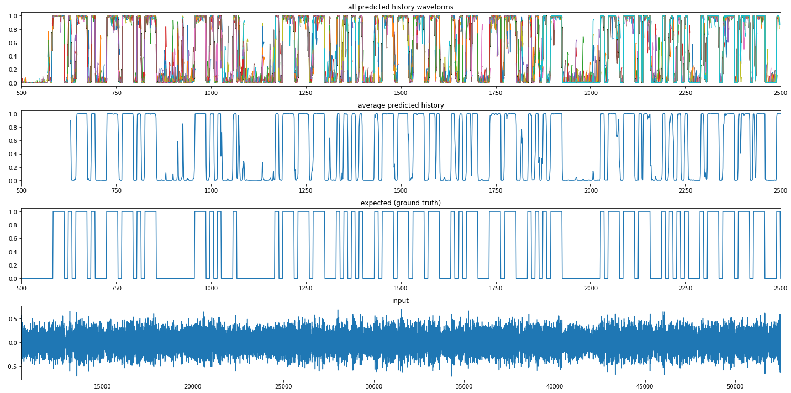

# CW-Morse-ML
Denoising / Recognizing CW morse code with machine learning

# Denosing Example

SNR=2dB (noise bandwidth = 500Hz) https://soundcloud.com/cho45/test-2db


SNR=10dB (noise bandwidth = 500Hz)


# Resources

 * [LoadData-Sample.ipynb](./LoadData-Sample.ipynb) Example of loading training wav with labels (Jupyter notebook)
 * [morselib.py](./morselib.py) some utility functions
 * [denoise/train.py](./denoise/train.py) example denoising training script CNN (keras)

# Generate dataset

 * [generate.py](./generate.py) generate some training files (ogg wav data and labels data)
 
## Labels Data

Labels data is compressed and saved as PNG. Its x-dimension (width) is same as wav(ogg) samples. Its y-dimension (height) is type of label data.

 * 0: keying data : This represents on/off of keying. On is 255 and Off is 0.
 * 1: morse id : This represents morse code id of keying. These ids are defined in DEFINED_MORSE_CODES of [DEFINITION.json](./DEFINITION.json).
 * 2: recognizing by human timing: This represents morse code id which is recognized by human timing. 

See also [morselib.py#L189]( ./morselib.py#L189 )

```
Label example:
( 0x05 means ".-")
Keying  : 0x00 0xff 0x00 0xff 0xff 0xff 0x00 0x00 0x00 0x00 ...
Morse ID: 0x00 0x05 0x05 0x05 0x05 0x05 0x05 0x05 0x05 0x00 ...
RHT     : 0x00 0x00 0x00 0x00 0x00 0x00 0x00 0x00 0x00 0x05 0x05 0x05 0x00
```
